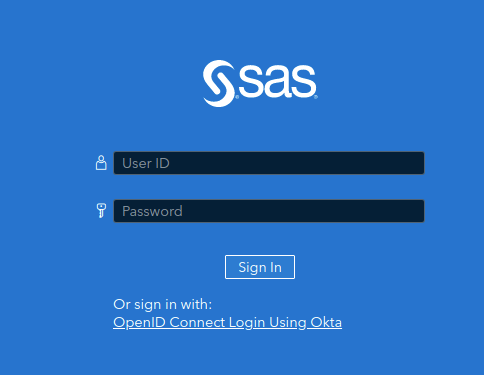
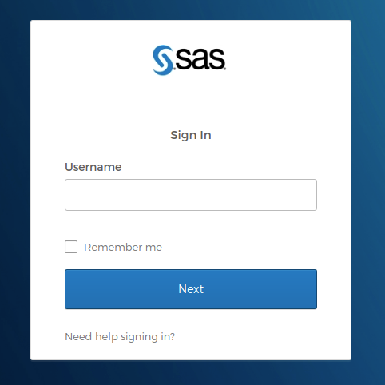
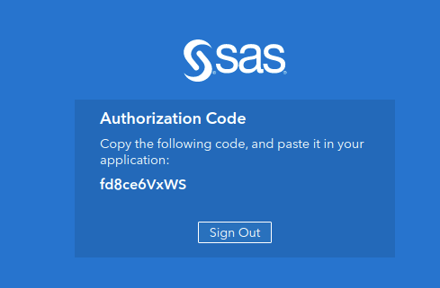

# Code and other materials from SAS Global Forum 2021

This repository features a selection of SAS code contributions that accompany the papers and presentations from SAS Global Forum 2021.  All code that is shared here might exist other places, such as in the author's personal GitHub, [SAS Support Communities](https://communities.sas.com), or simply as text within the published proceedings.  The paper authors have completed this extra step to make their example code easier to find and consume.

After the conference, you can find the directory of the published proceedings from SAS Global Forum 2021 at the [SAS Global Forum proceedings page in SAS Communities](https://communities.sas.com/t5/SAS-Global-Forum-proceedings/ct-p/proceedings).  


## Contributing code for your own paper

Are you a SAS Global Forum presenter?  If so, we welcome you to contribute any code or other useful material that might be of interest to those who read your paper.  See the [contribution guidelines and steps here](CONTRIBUTING.md). 

If you're new to GitHub and would like to see a walkthrough of a pull request, we recorded a short video (11 min) and [shared in the SAS Global Forum group on SAS Support Communities](https://communities.sas.com/t5/SAS-Global-Forum-2020/SAS-Global-Forum-2020-on-GitHub/gpm-p/614782).

## Table of Contents

### Demos and tutorials

* [Connecting the Dots between SAS Viya Products](./demos/connect-the-dots)
* [The Power of SAS SQL](./demos/power-of-sql)
* [SAS Procedure Output: Using Formats with ODS Style Options to Produce a Trafficlighting Effect](./demos/Trafficlight)

## Gitpod

This repository has been enabled to work with [Gitpod](https://www.gitpod.io/).

Gitpod does to Dev Environments what Docker did to Servers 🐳. Gitpod is an [open source platform](https://github.com/gitpod-io/gitpod) for automated and ready-to-code development environments. It enables developers to describe their dev environment as code and start instant and fresh development environments for each new task directly from your browser.

This is a great way to try out the Markdown/Notebook to PDF conversion tool.

## Binder

jld23 fork:
[](https://mybinder.org/v2/gh/jld23/sas-global-forum-2021/HEAD)

[](https://mybinder.org/v2/gh/sascommunities/sas-global-forum-2021/HEAD)

Binder will allow you to run the code interactively for papers that we're authored in a Jupyter Notebook format.

To run the code you will need a SAS Profile (which you probably already have but if not go [here](https://www.sas.com/profile/ui/#/create))

1. When you first attempt to run SAS code in a notebook, you will be prompted with this message:

    ```html
    To connect to Viya you need either an authcode or a userid/pw. Neither were provided.
    Please enter which one you want to enter next. Type one of these now: [authcode | userid]:
    ```

1. Type **authcode** -- that is the only option that works in this environment.
    You will then see this message (or one very similar):

    ```html
    The default url to authenticate with would be https://binder.demo.sas.com/SASLogon/oauth/authorize?client_id=SASPy&response_type=code
    ```

1. Open that URL in another browser tab and you will see a page similar to this:

    

1. Select the link for `OpenID Connect Login Using Okta`.

    

1. Follow the prompts to authenticate and then copy the authorication code into your clipboard (or write it down)

    

1. You now have a connection to SAS to run the code from the paper. This connection does not save any data or state. It will time out and has limited computing capcity.


