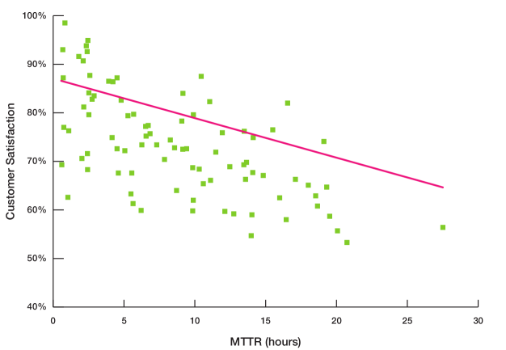

## ABSTRACT

Root Cause Analysis (RCA) is a common IT practice aimed at identifying the underlying causes of faults and problems with systems with the objective of resolving them quickly to ensure system uptime and customer satisfaction. When the results of this are measured, this is often referred to as Mean Time to Resolution (MTTR).

While common in IT generally, RCA is often not performed on SAS platform issues which can have a direct impact on system stability and overall user satisfaction of the system. The variety of workload types, number of servers involved, and the amount of moving parts can make performing RCAs of SAS platforms very difficult.

The objective of this paper is share tools, processes, and templates to enable SAS administrators to:

  - Understand what root cause analysis is and why it's important
  - Introduce Mean Time to Resolution and how it can be used
  - Demonstrate how to perform root cause analyses on a SAS platform in a way that isn't too scary or time consuming.

## INTRODUCTION

More and more organizations are relying on their analytics platforms to drive competitive advantage and run their businesses. As such, when these environments are unavailable it can have very real, very measurable impact on an organization. Often however, SAS&reg; is owned and run by the business and may not have a dedicated support group within the organization's IT department. And, even if it does, it may be that the SAS administrators who are in charge of running the SAS environment are not formally trained or experienced support personnel. 

Because of the organizational demand for analytics, pressure on the SAS administrator is increased and the  need to ensure that these systems are up, available, and performant is growing. In this regard, over the past 10 years or so there have been a number of significant improvements in the SAS landscape with things like High Availability (HA) and Disaster Recovery (DR) configuration options becoming easier to implement and available to more and more of the core SAS services.

Unfortunately, sometimes the worst does happen. There is an issue or a problem that causes SAS to stop functioning as expected and it is the job of the SAS administrator to bring the system back on-line as quickly as possible to ensure that the developers, analysts, and data consumers can do what they need to do. Changes are made, services are restarted, and normal service is resumed. Occasionally though (and sometimes more than we care to admit) the same issue might occur over and over again, perhaps with increasing frequency or severity of impact.

This paper discusses why Root Cause Analysis is an important process that all SAS Administration teams should perform. It discusses when to perform a Root Cause Analysis and shares some tips, templates, and applications that can support its effective use. Further, this paper discusses a metric that SAS administrators can use to measure their performance in a way that is comparable with other technical support teams. Mean Time To Resolution (MTTR) is an IT standard term for measuring the performance of an IT team and is, in my opinion, a great way for SAS administrators and their teams to measure their performance.

## MEAN TIME TO RESOLUTION

During my career I have worked as a consultant and as an in-house administrator for both larger and smaller organizations. What’s interesting about this is that I found the more mature an organization’s IT department or their SAS administration team’s processes, the more they were able to objectively and formally measure their performance. 

There is nothing inherently interesting or surprising about that: bigger more mature companies have more processes and ways or measuring stuff. But, what I did find is that, among the successful ones the key metric that they all seemed to measure was the same thing, they all seemed to measure something called “Mean Time to Resolution”. 

### What is Mean Time To Resolution?

Atlassian, the company behind tools like Jira, defines Mean Time to Resolution “as the average time it takes to fully resolve a failure”[@atlassianMTBFMTTRMTTFa] . The *resolve* word is important here because it means we are including not only the time spent detecting the failure, diagnosing the problem, and repairing the issue, but also the time spent understanding what happened and trying to ensure that the problem won’t happen again. 

It is likely that you might have heard of terms that are similar to Mean Time To Resolution, terms like Mean Time to Recovery, or Mean Time To Restore. These are subtly but importantly different. Recovering or restoring a system means getting it back on-line; either to a place where users can connect again, or that our scheduled workload can continue, but these metrics don't include the time that is required to be spent analyzing what happened and designing and implementing changes to ensure that the same event can't happen again. Those last couple of steps we of course recognize to be Root Cause Analysis. 

Mean Time To Resolution is a service level metric that measures the average elapsed time from when an incident is reported until an incident is resolved[@WhyYourTime2015]. It is calculated by dividing the amount of time spent *resolving* the problems by the number of incidents during the period we are measuring. For example, if we are calculating our Mean Time To Resolution number for a one month period and we had we had 2 incidents in the month and one took 8 hours to resolve and the there took 12 hours to resolve, our Mean Time To Resolution for that month would be 10 hours[@boemskaAllMTTR2020].

Something to note is that typically, when we are measuring mean time to resolution we only count business hours and for unplanned work[@rumburgMetricMonthMean2012]. If your system is only used 9-5 then you would only count the time spent during that time. If your system needs to be up and available 24 hours, perhaps because you have a batch window at night, then you would need to record time spent during that window too.

### Why do people use Mean Time To Resolution?

There is a strong correlation between customer satisfaction and low Mean Time To Resolution. Figure 1 illustrates the relationship between customer satisfaction and incident Mean Time To Resolution for a representative cross-section of global desktop support groups. The strong correlation between Mean Time To Resolution and customer satisfaction is readily apparent[@rumburgMetricMonthMean2012].

Another reason is that teams can measure track and measure their performance. This can be done individually at the administrator level at the team level, or even across teams. As we saw from how the metric is calculated, there are no specifics about the technologies used and its easy for people to understand. Plotting the metric makes sense to help see trends for periods like “same time last year” or “last quarter”. There is also potential for wider organizational benefit as if there is agreement of the definition of *resolve*d across the organization then it can be used by multiple teams to help the business understand their service levels.

### How can I improve my Mean Time To Resolution?

The correlation between customer satisfaction and Mean Time To Resolution is, alone, a compelling reason to want to track and improve upon your team's number. The following is a curated list of things that people or teams can look at doing in order to bring their Mean Time To Resolution number down[@ReducingMTTRRight].

#### Put SLAs on customers too

A controversial start? Perhaps. Hoever, if someone has said that something is important and is expecting that we get back to them within a certain amount of time (whether that be a defined SLA or not) I think that it is reasonable that we can expect the same of the. I don't think that this is something that everyone should be really draconian about, we're only looking to enforce these SLAs if customers are continually slow to respond to our requests.

However, it can't always be the customers fault that they are taking a long time to our queries. As such, its important that we ask ourselves why someone, or lots of people, take a long time to get back to us. is it because they are just busy with their regular day job or could the problem be as much our fault as theirs? Are we reviewing the answers or requests that we are sending to people? Are the next steps that we are asking someone to take clear?

#### Manage your own expectations

SAS is hard. At least, I think it is. Some issues involving SAS are really difficult to solve, often with many moving parts. What we can do though, is make sure that we keep people informed so that they know  what's going on, and that someone is still looking into their problem and that they are still working through all of the detailed information that we might have asked the customer to provide. This might seem formal, especially for an internal support team, and this might nor directly impact our Mean Time To Resolution number but it should definitely help to ensure that our users are happier about the service that we are providing them. 

#### Glacial paced teams

There is an inevitability and a dread to this. Within each organization there are teams that we love to work with, and there are teams that we dread working with. You're desperately hoping that it isn't a firewall issue because those guys are just so slow. Well, is there something that we can do to help? Is there a process issue where, maybe, we aren't providing enough information to them for them to be able to help us work through the issue. Is there a resourcing issue that senior management can help us to address?

#### Resolution time outliers

You might normally resolve most issues with a user in a few hours or a day or so. But occasionally something comes across the team's desk that's difficult, really difficult. There are lots of internal teams involved as well as one or more external vendor support teams. These issues really drag the numbers up. In this case, is the number that we are reporting the most appropriate metric? Is the *median* time to resolution a fairer representation of a teams performance[@SREErrorBudgets]? It may well be possible to justify to senior management that using this metric is a more accurate reflection of a team's performance? In some instances, this might be a much better metric than the more commonly accepted mean.

## ROOT CAUSE ANALYSIS

Before I started writing this paper I had always assumed the process of performing a Root Cause Analysis was just an IT thing. A process and technique that had been developed over the years by hardware and software engineers. It was after doing the research for this paper I realized how delightfully incorrect I was - Root Cause Analysis is everywhere! In fact, especially where SAS is concerned, it seems much more likely to be referenced in the context of industrial process control or clinical trials than IT[@raoJustFixIt2017]. But, it can also be found being used in telecommunications, Health and Safety[@RootCauseAnalysis2020], Quality Control[@WhatRootCause] , and Enterprise Risk Management[@RootCauseAnalysis2016].

Before getting into exactly when, how, and why SAS administrators should perform RCAs on their issues, it's important that we all understand exactly what we mean by "Root Cause Analysis".

### What is Root Cause Analysis?

Root Cause Analysis is a structured, facilitated, team process to identify the root causes of an event that resulted in an undesired outcome and develop corrective actions. The Root Cause Analysis process provides us with a way to identify breakdowns in processes and systems that contributed to the event and how to prevent the same event from happening again in the future. The purpose of a Root Cause Analysis is to find out what happened, why it happened, and determine what changes need to be made[@qapiGuidancePerformingRoot] so it doesn't happen again.

An event in this context is generally something bad or something undesirable. Simple examples of this from the point of view of a SAS administrator might be a job or a flow of jobs not completing successfully, the SAS environment going off-line and being unavailable for people to connect to, or one or more servers going down completely.

The root cause(s) in this context are the underlying reason(s) that primarily resulted in the undesirable event. As we will see, and why there are many different approaches to performing root causes analyses, the root cause(s) of an issue are not always obvious and a methodical approach to working through the problem is often required.

Root cause analyses don't need to be overly complex or onerous but they will always involve some work with input, ideally, from different people and teams. Because of this it doesn't always practically make sense to do full Root Cause Analysis, with the kitchen sink, for the smallest of issues. If your organization already prioritizes issues it may make sense to only perform root cause analyses on the most important issues. These are going to be the issues that cause your users the most pain and are the ones that we want to ensure don't happen again. 

There is also a category of issue that we might want to perform a Root Cause Analysis on that might not always be picked up by all issue trackers - the near miss. Near misses, while they fortunately didn't happen, could have resulted in significant outages or situations that we would want to avoid in the future[@qapiGuidancePerformingRoot].

Root Cause Analysis is a process to help teams find out what happened, why it happened, and determine how to prevent future occurrences of the same event. There are a few different techniques for performing it but they all involve getting a team together and systematically working through the problem. 

Some administrators and support teams, whether they know it or not, possibly already do a form of Root Cause Analysis on their issues. Its quite likely, that as a SAS administrator, you've been asked to provide an explanation as to why an outage occurred or an incident happened. The explanation that you give is a key part of Root Cause Analysis; clearly describing the problem and why it happened. You'll likely have been asked a follow-up question about the incident: will that thing happen again? This is _the_ key of Root Cause Analysis, where we identify and implement strategies for ensuring that events that happened don't happen again.

### Components of a Root Cause Analysis

Although there are a number of different ways to perform Root Cause Analysis they all abide by the same general principles that we mentioned earlier; Root Cause Analysis is a structured process of finding out _why_ something happened and designing changes to ensure that the same thing doesn't happen again. The result of that process, regardless of the method by which you used to get there, which we'll cover later, is delivered in report form. Your Root Cause Analysis report should contain the following sections:

#### A clear problem statement 

Clearly articulating the problem, what happened, when, and by whom, shows that the problem is well understood. You may find that the process of trying to distill a large and complex problem into a clear problem statement is beneficial to the understanding of the event for all. Well understood problems will likely stand a far better chance of being solved than poorly understood problems[@ProblemWellStated].

#### A time-line from normal operations to when the event occurred

Establishing what happened in the run up of the event helps us to understand the relationship between all of the events that happened in the environment that may have contributed to the event. The time-line, depending on the issue, could be just a few minutes or it could be several days[@RootCauseAnalysis2020]. 

Putting all of the things that happened into a sequence also helps us with the next stage of the process which is to:

#### Distinguish between the root cause(s) and other factors 

This is where we actually identify what the root cause(s) are. We need to be able to distinguish between something that we saw or that happened on the server _because_ of the root cause, or if the thing that happened is itself a root cause. For example, it's likely that when a failure in a system occurs, lots of warnings and errors will be seen in the logs for lots of different parts of the system. We may also have errors in logs that are from completely unrelated parts of the environment. It is important that we are able to understand and organize all of the events that have occurred and categorize them as either a root cause or causal effect, or a symptom of the problem.

Finally, as with any good report, we should:

#### Identify the corrective actions required

Arguably the most important part of the Root Cause Analysis process is the identification and implementation of actions to eliminate or control events and vulnerabilities that have been identified[@RCA2ImprovingRoot]. Simply put, the Root Cause Analysis report should identify the actions required, or the actions already taken to resolve the event. This section of the report should justify why the identified actions should prevent the same problem from happening again in the future. If a fix is not known or cannot be implemented, the report should also document why this is the case.

Teams should identify at least one stronger or intermediate strength action for each Root Cause Analysis. In some cases it may be necessary to recommend actions classified as weaker actions in the Action Hierarchy as temporary measures until stronger actions can be implemented. It should be understood that “weaker” actions such as training and policy changes are often necessary to establish proficiency and expectations, but when used alone are unlikely to be sufficient to provide sustained improvements[@RCA2ImprovingRoot].

| **Category** | Action                             |
| ------------ | ---------------------------------- |
| Stronger     | Architectural changes              |
| Stronger     | Tangible involvement by leadership |
| Stronger     | Process changes                    |
| Stronger     | Underlying software enhancements   |
| Intermediate | Program code changes               |
| Intermediate | Decrease system workload           |
| Intermediate | Use checklists                     |
| Intermediate | Enhance documentation              |
| Weaker       | Double checks                      |
| Weaker       | Warnings                           |
| Weaker       | New procedure/policy               |
| Weaker       | Training                           |

*Table 1: Action Hierarchy*[@RootCauseAnalysis].

### How to make Root Cause Analyses more effective

There are some things that we can do to improve the effectiveness and the efficiency of our root cause analyses, regardless of the method used:

#### Collect detailed information

Collecting as much information as possible about an event will enable the Root Cause Analysis team to gain a more complete understanding of the circumstances surrounding the event[@RCA2ImprovingRoot]. The information collected might be in many forms include application and system logs, source code, interviews with team members, system utilization metrics, etc. As with investigating a crime, its better to have more information than you need than to not have enough and have to hypothesize about probable cause.

#### Try not to include the parties involved 

This doesn't mean that we shouldn't be getting information from them. We know that we want to collect as much information as possible because this is going to give us the best possible chance of resolving our issue. What is meant here is that, if possible, the developer involved in writing the program that failed, or the administrator who was involved in the system recovery, shouldn't be on the Root Cause Analysis team as there is a tendency for people to be defensive and not objective when working through an event where their actions or decisions may be questioned.  A successful Root Cause Analysis process requires frank and open discussions of the causes of an event[@qapiGuidancePerformingRoot].

#### Use a multi-disciplinary team

All events have a root cause. The purpose of Root Cause Analysis is to systematically work through all of the information available and find that cause and then design and implement changes that will ensure that the same event won't happen again. People from different parts of organizations and different teams think about things differently[@dyerLearnHowThink2011] and that change in perspective might be just the key to unlocking a problem or designing a really great change.

#### Use all the resources available to you

In the GitHub repository for SAS Global Forum 2021, and in the folder for this paper, I have included a sample Root Cause Analysis report template that you can use for structuring and sharing reports within your organization. 

We also know that collecting as much data as possible about our environment will help us put together our time-line of what happened before, during and after an event, and that all of this information will help us to identify the root cause of the issue. But, as I am sure that many of you will know, working out which SAS program, or user, ran under a given process ID, on a given server, on a given day, at some point in time, can be very, very difficult and time consuming. 

Therefore, one of the biggest things that you can do is to instrument your SAS environment with a decent observability tool. Something, perhaps, like  Enterprise Session Monitor (or ESM). Not only will you be able to recover and restore your system faster by being able to find problematic processes and SAS sessions in real time, but because ESM stores all of the data that it captures about SAS sessions, you can go back in time, as far as you need to to create your time-line of events. You can browse and search for specific jobs, users, flows, process IDs, and even errors, and you can open the log files for your SAS programs right from your browser. Its incredible how much faster you can discover the real cause of your outages.

_Display 1 The Advanced Job Search view in Enterprise Session Monitor with the Resource Breakdown View expanded._

### Methods of Root Cause Analysis

All of the different aspects of Root Cause Analysis that we have covered so far remain the same regardless of the method used to perform the actual analysis. By "the analysis" we mean the systematic process by which the information collected is investigated to understand the underlying cause(s) of an event. There are a number of common methods for performing Root Cause Analysis. The method that you use to investigate the events that occur at your organization, will perhaps depend on the event type, any organizational directives that you may have regarding root cause analyses, and the personal preferences of the Root Cause Analysis team.

#### 5-whys method

Perhaps the simplest method for Root Cause Analysis is the "5-why's" technique[^*] . This method simply involves asking "why?" about 5 times. The method is iterative and interactive. If the answer to the first round of "whys" doesn't provide a root cause then we continue to the second round of "whys" and so on. Although the method is called the "5-whys" this is just a rule of thumb.

[^*]: The fact that this method is the simplest method is probably why it is my favorite.

#### Causal tree

In a causal tree, the worst thing that happened or nearly happened (in the case of a near miss) is placed at the top. In a near miss situation, a prevention or recovery side is added to capture how an error was prevented. This is important in identifying the safety nets that exist. 

In either scenario, the team's responsibility is to capture the causes for the top event, followed by the causes of the secondary events, and so on, continuing on until there are no more events to capture causes for. The last causes captured on each "branch" of the tree are the root causes[@williamsTechniquesRootCause2001].

#### Difference analysis

In this type of analysis a comparative study of the circumstances when the issue is there versus when the issue is not present are performed. Recent changes in the processes or programs are accounted for as well as external factors that may or may not have been present. This method is effective if a failure occurs after an update to a system or program[@raoJustFixIt2017].

## CONCLUSION

Do it, you know that you want to.

## ACKNOWLEDGMENTS

I'd like to thank SAS, and in particular, Nikola Markovic for affording me the time to work on this paper. I'd also like to thank my wife, Katie, for being Editor in Residence, without whom this paper would have read very differently!

## RECOMMENDED READING

All of the papers that I have referenced in this paper are worth checking out, but if you only have time to read two things, I'd chose:

* RCA2 Improving Root Cause Analyses and Actions to Prevent Harm - National Patient Safety Forum
* Guidance for Performing Root Cause Analysis (RCA) with Performance Improvement Projects (PIPs) - Center for Medicare and Medicaid Services

## CONTACT INFORMATION

Your comments and questions are valued and encouraged. Contact the author at:

> Christopher Blake
> Email: christopher.j.blake@sas.com

SAS and all other SAS Institute Inc. product or service names are registered trademarks or trademarks of SAS Institute Inc. in the USA and other Countries &reg; indicates USA registration.

Other brand and product names are trademarks of their respective companies.

## REFERENCES

[//]: # ""You only need to add references here that you haven't automatically added or referenced using Zoreto.""

